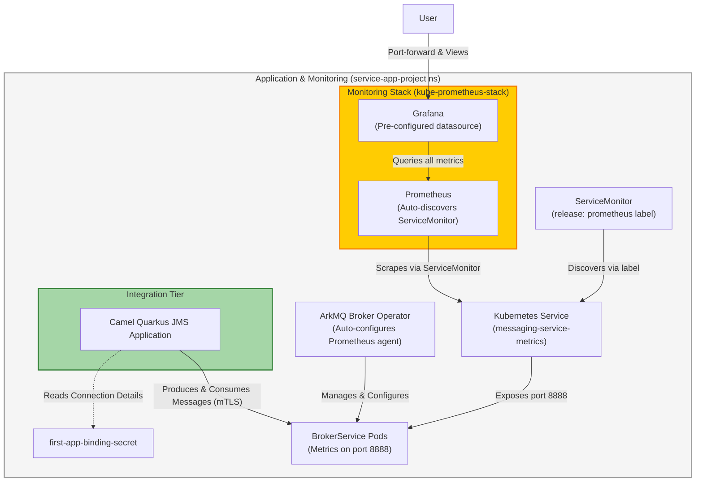

This tutorial shows how to deploy messaging infrastructure using the **Separation of Concerns** pattern with the `BrokerService` and `BrokerApp` Custom Resources (CRDs).

It covers deploying the automated infrastructure, testing it with a Camel Quarkus application, and configuring a secure Prometheus/Grafana stack to visualize the throughput and resource footprint.

## What is the Separation of Concerns?

**Operations teams** deploy a `BrokerService` (an infrastructure appliance), while **Developers** deploy a `BrokerApp` (a declaration of their messaging intent). The Operator automatically wires them together, creates the queues, and assigns dynamic ports.

## Why monitor this way?

Because the `BrokerService` acts as a "black box" appliance to simplify deployments, it does not expose a Kubernetes Service for the metrics port by default. To achieve observability, this tutorial demonstrates how to:

1. Create a Kubernetes Service to expose the metrics port (8888)
2. Use a ServiceMonitor to configure Prometheus scraping
3. Access Grafana via port-forwarding to view the metrics

**Note:** The ArkMQ Broker Operator automatically configures the Prometheus Java agent on port 8888 inside the broker pods. We don't need to manually inject the agent - the Operator handles this for us. We just need to create the Service and ServiceMonitor to make the metrics accessible to Prometheus.

## Architecture Overview

### Component Interactions

This diagram shows the operational flow between components during normal monitoring and messaging:



## Prerequisites

- A running Kubernetes cluster (this tutorial uses `minikube`)
- `kubectl` configured to interact with your cluster
- `helm` installed for deploying monitoring components

## 1. Setup Infrastructure

### Start Minikube

```bash {"stage":"init", "id":"minikube_start", "runtime":"bash"}
minikube start --profile brokerservice-monitoring --cpus 8 --memory 8192 --disk-size 8000
minikube profile brokerservice-monitoring
```

### Create Namespace

```bash {"stage":"init", "runtime":"bash"}
kubectl create namespace service-app-project
kubectl config set-context --current --namespace=service-app-project
```

### Install Cert-Manager

```bash {"stage":"init", "label":"install cert-manager", "runtime":"bash"}
kubectl apply -f https://github.com/cert-manager/cert-manager/releases/download/v1.15.1/cert-manager.yaml
```

Wait for `cert-manager` to be ready.

```bash {"stage":"init", "label":"wait for cert-manager", "runtime":"bash"}
kubectl wait deployment --for=condition=Available -n cert-manager --timeout=600s cert-manager cert-manager-cainjector cert-manager-webhook
```

### Install Trust Manager

First, add the Jetstack Helm repository.

```bash {"stage":"init", "label":"add jetstack helm repo", "runtime":"bash"}
helm repo add jetstack https://charts.jetstack.io --force-update
```

Now, install `trust-manager`.

```bash {"stage":"init", "label":"install trust-manager", "runtime":"bash"}
helm upgrade trust-manager jetstack/trust-manager --install --namespace cert-manager --set secretTargets.enabled=true --set secretTargets.authorizedSecretsAll=true --wait
```

### Install kube-prometheus-stack

Install the Prometheus Operator and Grafana stack. This provides the monitoring infrastructure that will automatically discover our ServiceMonitor:

```bash {"stage":"init", "label":"add prometheus helm repo", "runtime":"bash"}
helm repo add prometheus-community https://prometheus-community.github.io/helm-charts
helm repo update
```

```bash {"stage":"init", "label":"install kube-prometheus-stack", "runtime":"bash"}
helm upgrade -i prometheus prometheus-community/kube-prometheus-stack \
  -n service-app-project \
  --set grafana.sidecar.dashboards.enabled=true \
  --set grafana.sidecar.dashboards.label=grafana_dashboard \
  --set grafana.sidecar.dashboards.searchNamespace=ALL \
  --set grafana.sidecar.datasources.enabled=true \
  --set kubeEtcd.enabled=false \
  --set kubeControllerManager.enabled=false \
  --set kubeScheduler.enabled=false \
  --wait
```

This installs:
- **Prometheus Operator**: Manages Prometheus instances and ServiceMonitors
- **Prometheus**: Collects metrics from targets
- **Grafana**: Visualizes metrics with dashboards
- **ServiceMonitor CRDs**: Enables automatic target discovery

Wait for all components to be ready:

```bash {"stage":"init", "label":"wait for prometheus stack", "runtime":"bash"}
kubectl wait deployment --for=condition=Available -n service-app-project prometheus-grafana prometheus-kube-prometheus-operator --timeout=300s
kubectl wait statefulset --for=jsonpath='{.status.readyReplicas}'=1 -n service-app-project prometheus-prometheus-kube-prometheus-prometheus --timeout=300s
```

### Install the Operator

```bash {"stage":"init", "rootdir":"$initial_dir", "runtime":"bash"}
./deploy/install_opr.sh
```

Wait for the operator pod to become ready.

```bash {"stage":"init", "label":"wait for the operator to be running", "runtime":"bash"}
kubectl wait deployment arkmq-org-broker-controller-manager --for=create --timeout=240s
kubectl wait pod --all --for=condition=Ready --namespace=service-app-project --timeout=600s
```

## 2. Configure Certificates

We'll set up a CA and issue certificates for the operator, the service, and the application.

### Create Issuers and Root Certificate

First the root issuer.

```bash {"stage":"deploy_certs", "label":"create root issuer", "runtime":"bash"}
kubectl apply -f - <<EOF
apiVersion: cert-manager.io/v1
kind: ClusterIssuer
metadata:
  name: root-issuer
spec:
  selfSigned: {}
EOF
```

```bash {"stage":"deploy_certs", "label":"wait for root issuer", "runtime":"bash"}
kubectl wait clusterissuer root-issuer --for=condition=Ready --timeout=300s
```

Then the root certificate.

```bash {"stage":"deploy_certs", "label":"create root cert", "runtime":"bash"}
kubectl apply -f - <<EOF
apiVersion: cert-manager.io/v1
kind: Certificate
metadata:
  name: root-cert
  namespace: cert-manager
spec:
  isCA: true
  commonName: artemis.root.ca
  secretName: artemis-root-cert-secret
  issuerRef:
    name: root-issuer
    kind: ClusterIssuer
EOF
```

```bash {"stage":"deploy_certs", "label":"wait for root cert", "runtime":"bash"}
kubectl wait certificate root-cert --for=condition=Ready -n cert-manager --timeout=300s
```

Then a signing issuer that uses the root certificate.

```bash {"stage":"deploy_certs", "label":"create signing issuer", "runtime":"bash"}
kubectl apply -f - <<EOF
apiVersion: cert-manager.io/v1
kind: ClusterIssuer
metadata:
  name: broker-ca-issuer
spec:
  ca:
    secretName: artemis-root-cert-secret
EOF
```

```bash {"stage":"deploy_certs", "label":"wait for signing issuer", "runtime":"bash"}
kubectl wait clusterissuer broker-ca-issuer --for=condition=Ready --timeout=300s
```

### Create Operator Certificate

#### Install the CA Bundle in the `cert-manager` namespace

```bash {"stage":"deploy_certs", "label":"create ca bundle", "runtime":"bash"}
kubectl apply -f - <<EOF
apiVersion: trust.cert-manager.io/v1alpha1
kind: Bundle
metadata:
  name: arkmq-org-broker-manager-ca
  namespace: cert-manager
spec:
  sources:
  - secret:
      name: artemis-root-cert-secret
      key: "tls.crt"
  target:
    secret:
      key: "ca.pem"
EOF
```

```bash {"stage":"deploy_certs", "label":"wait for ca bundle", "runtime":"bash"}
kubectl wait bundle arkmq-org-broker-manager-ca -n cert-manager --for=condition=Synced --timeout=300s
```

#### Create the certificate for the operator

```bash {"stage":"deploy_certs", "label":"create operator cert", "runtime":"bash"}
kubectl apply -f - <<EOF
apiVersion: cert-manager.io/v1
kind: Certificate
metadata:
  name: arkmq-org-broker-manager-cert
  namespace: service-app-project
spec:
  secretName: arkmq-org-broker-manager-cert
  commonName: arkmq-org-broker-operator
  issuerRef:
    name: broker-ca-issuer
    kind: ClusterIssuer
EOF
```

```bash {"stage":"deploy_certs", "label":"wait for operator cert", "runtime":"bash"}
kubectl wait certificate arkmq-org-broker-manager-cert -n service-app-project --for=condition=Ready --timeout=300s
```

## 3. Deploy BrokerService

### Create BrokerService Certificate

The service needs a certificate customized with a matching common name to enable mTLS communication.

```bash {"stage":"deploy_service", "label":"create broker cert", "runtime":"bash"}
kubectl apply -f - <<EOF
apiVersion: cert-manager.io/v1
kind: Certificate
metadata:
  name: messaging-service-broker-cert
  namespace: service-app-project
spec:
  secretName: messaging-service-broker-cert
  commonName: messaging-service
  dnsNames:
  - messaging-service
  - messaging-service.service-app-project.svc.cluster.local
  - '*.messaging-service-hdls-svc.service-app-project.svc.cluster.local'
  issuerRef:
    name: broker-ca-issuer
    kind: ClusterIssuer
EOF
```

```bash {"stage":"deploy_service", "label":"wait for broker cert", "runtime":"bash"}
kubectl wait certificate messaging-service-broker-cert -n service-app-project --for=condition=Ready --timeout=300s
```

### Deploy BrokerService

Deploy the `BrokerService`. The ArkMQ Operator automatically configures the Prometheus JMX exporter on port 8888:

```bash {"stage":"deploy_service", "label":"deploy brokerservice", "runtime":"bash"}
kubectl apply -f - <<EOF
apiVersion: broker.arkmq.org/v1beta2
kind: BrokerService
metadata:
  name: messaging-service
  namespace: service-app-project
  labels:
    forWorkQueue: "true"
spec:
  resources:
    limits:
      memory: "1Gi"
  env:
    - name: JAVA_ARGS_APPEND
      value: "-Dlog4j2.level=INFO"
EOF
```

Wait for the BrokerService to be ready:

```bash {"stage":"deploy_service", "label":"wait for brokerservice", "runtime":"bash"}
kubectl wait BrokerService messaging-service -n service-app-project --for=condition=Ready --timeout=300s
```

## 4. Deploy BrokerApp

The `BrokerApp` declares the messaging requirements for the application.

### Create Application Certificate

```bash {"stage":"deploy_app", "label":"create app cert", "runtime":"bash"}
kubectl apply -f - <<EOF
apiVersion: cert-manager.io/v1
kind: Certificate
metadata:
  name: first-app-app-cert
  namespace: service-app-project
spec:
  secretName: first-app-app-cert
  commonName: first-app
  issuerRef:
    name: broker-ca-issuer
    kind: ClusterIssuer
EOF
```

### Deploy BrokerApp

The `BrokerApp` connects to the `BrokerService` using label selectors and declares its messaging capabilities:

```bash {"stage":"deploy_app", "label":"deploy brokerapp", "runtime":"bash"}
kubectl apply -f - <<EOF
apiVersion: broker.arkmq.org/v1beta2
kind: BrokerApp
metadata:
  name: first-app
  namespace: service-app-project
spec:
  selector:
    matchLabels:
      forWorkQueue: "true"
  capabilities:
    - consumerOf:
        - address: "ORDERS.NEW"
      producerOf:
        - address: "ORDERS.PROCESSED"
        - address: "ORDERS.NEW"
EOF
```

Wait for the BrokerApp to be ready.

```bash {"stage":"deploy_app", "label":"wait for brokerapp", "runtime":"bash"}
kubectl wait BrokerApp first-app -n service-app-project --for=condition=Ready --timeout=300s
```

### Verify Port Assignment

Check the automatically assigned port:

```bash {"stage":"deploy_app", "label":"check port assignment", "runtime":"bash"}
kubectl get BrokerApp first-app -n service-app-project -o jsonpath='{.status.assignedPort}{"\n"}'
```

## 5. Deploy Camel Quarkus Application

The Camel application will read connection details from the binding secret created by the operator.

### Create PEM Configuration Secret

Create a secret with PEM keystore configuration:

```bash {"stage":"deploy_camel", "label":"create pemcfg secret", "runtime":"bash"}
kubectl apply -f - <<EOF
apiVersion: v1
kind: Secret
metadata:
  name: cert-pemcfg
  namespace: service-app-project
type: Opaque
stringData:
  tls.pemcfg: |
    source.key=/app/tls/client/tls.key
    source.cert=/app/tls/client/tls.crt
  java.security: security.provider.6=de.dentrassi.crypto.pem.PemKeyStoreProvider
EOF
```

### Deploy Camel Application

```bash {"stage":"deploy_camel", "label":"deploy camel app", "runtime":"bash"}
kubectl apply -f - <<EOF
apiVersion: apps/v1
kind: Deployment
metadata:
  name: camel-jms-app
  namespace: service-app-project
spec:
  replicas: 1
  selector:
    matchLabels:
      app: camel-jms-app
  template:
    metadata:
      labels:
        app: camel-jms-app
    spec:
      containers:
      - name: camel-jms-app
        image: quay.io/rh-ee-vnachiap/camel-jms-app:5.0.0
        imagePullPolicy: Always
        env:
        - name: BROKER_HOST
          valueFrom:
            secretKeyRef:
              name: first-app-binding-secret
              key: host
        - name: BROKER_PORT
          valueFrom:
            secretKeyRef:
              name: first-app-binding-secret
              key: port
        - name: PRODUCER_QUEUE
          value: "ORDERS.PROCESSED"
        - name: CONSUMER_QUEUE
          value: "ORDERS.NEW"
        - name: CLIENT_USERNAME
          value: "first-app"
        - name: JDK_JAVA_OPTIONS
          value: "-Xbootclasspath/a:/deployments/lib/main/de.dentrassi.crypto.pem-keystore-3.0.0.jar:/deployments/lib/main/com.hierynomus.asn-one-0.6.0.jar:/deployments/lib/main/org.slf4j.slf4j-api-2.0.18.jar -Djava.security.properties=/app/tls/pem/java.security"
        volumeMounts:
        - name: trust
          mountPath: /app/tls/ca
          readOnly: true
        - name: cert
          mountPath: /app/tls/client
          readOnly: true
        - name: pem
          mountPath: /app/tls/pem
          readOnly: true
      volumes:
      - name: trust
        secret:
          secretName: arkmq-org-broker-manager-ca
      - name: cert
        secret:
          secretName: first-app-app-cert
      - name: pem
        secret:
          secretName: cert-pemcfg
EOF
```

Wait for the Camel application to be ready.

```bash {"stage":"deploy_camel", "label":"wait for camel app", "runtime":"bash"}
kubectl wait deployment camel-jms-app -n service-app-project --for=condition=Available --timeout=300s
```

### Verify Messaging

Check the Camel application logs to see messages being produced and consumed:

```bash {"stage":"verify", "label":"check camel logs", "runtime":"bash"}
kubectl logs -n service-app-project deployment/camel-jms-app --tail=50
```

You should see:
- Producer route sending messages every 10 seconds
- Consumer route receiving and processing messages
- No connection errors

## 6. Setup Prometheus Monitoring

Now we'll configure the **default Prometheus stack** (from kube-prometheus-stack) to scrape metrics from the broker using HTTPS with mTLS authentication.

### Why Use the Default Stack?

The kube-prometheus-stack we installed in Step 1 already includes:
- ✅ Prometheus with proper RBAC permissions
- ✅ Grafana with pre-configured datasource
- ✅ Automatic ServiceMonitor discovery

### Understanding the Metrics Endpoint Security

The broker's Prometheus Java agent on port 8888 requires:
- **HTTPS** (not HTTP) - encrypted communication
- **mTLS** (mutual TLS) - both client and server authenticate with certificates
- **Identity-based access** - the client certificate's Common Name determines access permissions

We need to:
1. Create a Prometheus client certificate for authentication
2. Create a Kubernetes Service to expose the broker's metrics port (8888)
3. Create a ServiceMonitor with HTTPS and mTLS configuration
4. Create a Grafana dashboard ConfigMap

### Set Broker FQDN Environment Variable

Set the broker's fully qualified domain name for use in the ServiceMonitor configuration:

```bash {"stage":"monitoring", "label":"set broker fqdn", "runtime":"bash"}
export BROKER_FQDN=messaging-service-ss-0.messaging-service-hdls-svc.service-app-project.svc.cluster.local
echo "Broker FQDN: ${BROKER_FQDN}"
```

### Create Prometheus Client Certificate

**CRITICAL:** The certificate secret MUST be named exactly `prometheus-cert` because the ArkMQ Operator looks for this specific name to configure the broker's access control list.

Create a certificate for Prometheus to authenticate with the broker:

```bash {"stage":"monitoring", "label":"create prometheus cert", "runtime":"bash"}
kubectl apply -f - <<EOF
apiVersion: cert-manager.io/v1
kind: Certificate
metadata:
  name: prometheus-cert
  namespace: service-app-project
spec:
  secretName: prometheus-cert
  commonName: prometheus
  issuerRef:
    name: broker-ca-issuer
    kind: ClusterIssuer
EOF
```

**Why this exact name matters:**
- The ArkMQ Operator scans the namespace for a secret named `prometheus-cert`
- When found, it extracts the Common Name and adds it to the broker's JAAS allowed list
- Any other name (like `prometheus-metrics-cert`) will be ignored by the Operator
- Without this, you'll get `401 Unauthorized` errors

Wait for the certificate to be ready:

```bash {"stage":"monitoring", "label":"wait for prometheus cert", "runtime":"bash"}
kubectl wait certificate prometheus-cert -n service-app-project --for=condition=Ready --timeout=300s
```

Verify the certificate was created successfully:

```bash {"stage":"monitoring", "label":"verify prometheus cert", "runtime":"bash"}
kubectl get certificate prometheus-cert -n service-app-project
kubectl get secret prometheus-cert -n service-app-project
```

You should see the certificate in "Ready" state and the secret containing `tls.crt`, `tls.key`, and `ca.crt`.

### Create Metrics Service

Create a Kubernetes Service that exposes the broker's metrics port (8888):

```bash {"stage":"monitoring", "label":"create metrics service", "runtime":"bash"}
kubectl apply -f - <<EOF
apiVersion: v1
kind: Service
metadata:
  name: messaging-service-metrics
  namespace: service-app-project
  labels:
    app: messaging-service
spec:
  selector:
    ActiveMQArtemis: messaging-service
  ports:
    - name: metrics
      port: 8888
      targetPort: 8888
      protocol: TCP
EOF
```

### Create ServiceMonitor with mTLS

Create a ServiceMonitor configured for HTTPS with mTLS authentication. The `release: prometheus` label tells the default Prometheus to automatically discover and scrape this target.

**Note:** This uses the `${BROKER_FQDN}` environment variable set earlier for the `serverName` field:

```bash {"stage":"monitoring", "label":"create servicemonitor", "runtime":"bash"}
kubectl apply -f - <<EOF
apiVersion: monitoring.coreos.com/v1
kind: ServiceMonitor
metadata:
  name: messaging-service-monitor
  namespace: service-app-project
  labels:
    app: messaging-service
    release: prometheus
spec:
  selector:
    matchLabels:
      app: messaging-service
  endpoints:
  - port: metrics
    scheme: https
    interval: 30s
    tlsConfig:
      # The server name for certificate validation.
      serverName: '${BROKER_FQDN}'
      # CA certificate to trust the broker's server certificate.
      ca:
        secret:
          name: arkmq-org-broker-manager-ca
          key: ca.pem
      # Client certificate for mutual TLS authentication.
      cert:
        secret:
          name: prometheus-cert
          key: tls.crt
      # Client private key.
      keySecret:
        name: prometheus-cert
        key: tls.key
      # Enforce certificate validation.
      insecureSkipVerify: false
EOF
```

**Important Configuration Details:**
- `scheme: https` - Use HTTPS instead of HTTP (port 8888 requires HTTPS)
- `serverName` - The broker's FQDN for certificate validation (prevents hostname mismatch)
- `ca` - CA certificate to trust the broker's server certificate
- `cert` + `keySecret` - Prometheus client certificate for mTLS authentication (MUST be named `prometheus-cert`)
- `insecureSkipVerify: false` - Enforce proper certificate validation
- `release: prometheus` label - Connects to the default Prometheus instance

### Verify Prometheus is Scraping

The default Prometheus should automatically discover the ServiceMonitor within 30 seconds. You can verify by port-forwarding to Prometheus:

```bash {"stage":"monitoring", "label":"port forward prometheus", "runtime":"bash"}
kubectl port-forward svc/prometheus-kube-prometheus-prometheus -n service-app-project 9090:9090
```

Then open http://localhost:9090/targets in your browser and verify:
- Target `serviceMonitor/service-app-project/messaging-service-monitor/0` appears
- Endpoint shows `messaging-service-metrics:8888`
- State is "UP" (green)

## 7. Create Grafana Dashboard

The kube-prometheus-stack already includes Grafana with a pre-configured Prometheus datasource. Instead of relying on the Grafana sidecar to discover ConfigMaps (which can be unreliable), we'll inject the dashboard directly into Grafana's provisioning system using Helm values.

### Create Dashboard Values File

Create a Helm values file containing the dashboard configuration. This dashboard uses the JMX exporter metrics that are automatically exposed by the Operator:

```bash {"stage":"grafana", "label":"create dashboard values", "runtime":"bash"}
cat << 'EOF' > grafana-complete-values.yaml
grafana:
  sidecar:
    dashboards:
      enabled: true
      label: grafana_dashboard
      searchNamespace: ALL
    datasources:
      enabled: true
  dashboards:
    default:
      artemis-broker-metrics:
        json: |
          {
            "__inputs": [],
            "__requires": [],
            "annotations": { "list": [] },
            "editable": true,
            "gnetId": null,
            "graphTooltip": 0,
            "id": null,
            "links": [],
            "panels": [
              {
                "datasource": { "type": "prometheus", "uid": "prometheus" },
                "fieldConfig": {
                  "defaults": {
                    "color": { "mode": "palette-classic" },
                    "custom": {
                      "axisCenteredZero": false,
                      "axisColorMode": "text",
                      "axisLabel": "",
                      "axisPlacement": "auto",
                      "barAlignment": 0,
                      "drawStyle": "line",
                      "fillOpacity": 10,
                      "gradientMode": "none",
                      "hideFrom": { "tooltip": false, "viz": false, "legend": false },
                      "lineInterpolation": "linear",
                      "lineWidth": 1,
                      "pointSize": 5,
                      "scaleDistribution": { "type": "linear" },
                      "showPoints": "never",
                      "spanNulls": false,
                      "stacking": { "group": "A", "mode": "none" },
                      "thresholdsStyle": { "mode": "off" }
                    },
                    "mappings": [],
                    "thresholds": {
                      "mode": "absolute",
                      "steps": [{ "color": "green", "value": null }]
                    },
                    "unit": "short"
                  },
                  "overrides": []
                },
                "gridPos": { "h": 8, "w": 12, "x": 0, "y": 0 },
                "id": 1,
                "options": {
                  "legend": { "calcs": [], "displayMode": "list", "placement": "bottom", "showLegend": true },
                  "tooltip": { "mode": "single", "sort": "none" }
                },
                "targets": [{
                  "datasource": { "type": "prometheus", "uid": "prometheus" },
                  "expr": "sum(broker_queue_message_count{job=\"messaging-service-metrics\"})",
                  "refId": "A",
                  "legendFormat": "Total Messages"
                }],
                "title": "Queue Message Count",
                "type": "timeseries"
              },
              {
                "datasource": { "type": "prometheus", "uid": "prometheus" },
                "fieldConfig": {
                  "defaults": {
                    "color": { "mode": "palette-classic" },
                    "custom": {
                      "axisCenteredZero": false,
                      "axisColorMode": "text",
                      "axisLabel": "",
                      "axisPlacement": "auto",
                      "barAlignment": 0,
                      "drawStyle": "line",
                      "fillOpacity": 10,
                      "gradientMode": "none",
                      "hideFrom": { "tooltip": false, "viz": false, "legend": false },
                      "lineInterpolation": "linear",
                      "lineWidth": 1,
                      "pointSize": 5,
                      "scaleDistribution": { "type": "linear" },
                      "showPoints": "never",
                      "spanNulls": false,
                      "stacking": { "group": "A", "mode": "none" },
                      "thresholdsStyle": { "mode": "off" }
                    },
                    "mappings": [],
                    "thresholds": {
                      "mode": "absolute",
                      "steps": [{ "color": "green", "value": null }]
                    },
                    "unit": "short"
                  },
                  "overrides": []
                },
                "gridPos": { "h": 8, "w": 12, "x": 12, "y": 0 },
                "id": 2,
                "options": {
                  "legend": { "calcs": [], "displayMode": "list", "placement": "bottom", "showLegend": true },
                  "tooltip": { "mode": "single", "sort": "none" }
                },
                "targets": [{
                  "datasource": { "type": "prometheus", "uid": "prometheus" },
                  "expr": "sum(broker_queue_consumer_count{job=\"messaging-service-metrics\"})",
                  "refId": "A",
                  "legendFormat": "Active Consumers"
                }],
                "title": "Queue Consumer Count",
                "type": "timeseries"
              },
              {
                "datasource": { "type": "prometheus", "uid": "prometheus" },
                "fieldConfig": {
                  "defaults": {
                    "color": { "mode": "palette-classic" },
                    "custom": {
                      "axisCenteredZero": false,
                      "axisColorMode": "text",
                      "axisLabel": "",
                      "axisPlacement": "auto",
                      "barAlignment": 0,
                      "drawStyle": "line",
                      "fillOpacity": 10,
                      "gradientMode": "none",
                      "hideFrom": { "tooltip": false, "viz": false, "legend": false },
                      "lineInterpolation": "linear",
                      "lineWidth": 1,
                      "pointSize": 5,
                      "scaleDistribution": { "type": "linear" },
                      "showPoints": "never",
                      "spanNulls": false,
                      "stacking": { "group": "A", "mode": "none" },
                      "thresholdsStyle": { "mode": "off" }
                    },
                    "mappings": [],
                    "thresholds": {
                      "mode": "absolute",
                      "steps": [{ "color": "green", "value": null }]
                    },
                    "unit": "short"
                  },
                  "overrides": []
                },
                "gridPos": { "h": 8, "w": 12, "x": 0, "y": 8 },
                "id": 3,
                "options": {
                  "legend": { "calcs": [], "displayMode": "list", "placement": "bottom", "showLegend": true },
                  "tooltip": { "mode": "single", "sort": "none" }
                },
                "targets": [{
                  "datasource": { "type": "prometheus", "uid": "prometheus" },
                  "expr": "sum(broker_queue_delivering_count{job=\"messaging-service-metrics\"})",
                  "refId": "A",
                  "legendFormat": "Delivering"
                }],
                "title": "Messages Being Delivered",
                "type": "timeseries"
              },
              {
                "datasource": { "type": "prometheus", "uid": "prometheus" },
                "fieldConfig": {
                  "defaults": {
                    "color": { "mode": "palette-classic" },
                    "custom": {
                      "axisCenteredZero": false,
                      "axisColorMode": "text",
                      "axisLabel": "",
                      "axisPlacement": "auto",
                      "barAlignment": 0,
                      "drawStyle": "line",
                      "fillOpacity": 10,
                      "gradientMode": "none",
                      "hideFrom": { "tooltip": false, "viz": false, "legend": false },
                      "lineInterpolation": "linear",
                      "lineWidth": 1,
                      "pointSize": 5,
                      "scaleDistribution": { "type": "linear" },
                      "showPoints": "never",
                      "spanNulls": false,
                      "stacking": { "group": "A", "mode": "none" },
                      "thresholdsStyle": { "mode": "off" }
                    },
                    "mappings": [],
                    "thresholds": {
                      "mode": "absolute",
                      "steps": [{ "color": "green", "value": null }]
                    },
                    "unit": "bytes"
                  },
                  "overrides": []
                },
                "gridPos": { "h": 8, "w": 12, "x": 12, "y": 8 },
                "id": 4,
                "options": {
                  "legend": { "calcs": [], "displayMode": "list", "placement": "bottom", "showLegend": true },
                  "tooltip": { "mode": "single", "sort": "none" }
                },
                "targets": [{
                  "datasource": { "type": "prometheus", "uid": "prometheus" },
                  "expr": "sum(broker_queue_persistent_size{job=\"messaging-service-metrics\"})",
                  "refId": "A",
                  "legendFormat": "Disk Usage"
                }],
                "title": "Queue Persistent Size",
                "type": "timeseries"
              }
            ],
            "refresh": "5s",
            "schemaVersion": 38,
            "style": "dark",
            "tags": ["artemis", "messaging"],
            "templating": { "list": [] },
            "time": { "from": "now-5m", "to": "now" },
            "timepicker": {},
            "timezone": "",
            "title": "Artemis Broker Metrics (JMX Exporter)",
            "uid": "artemis-broker-jmx",
            "version": 1,
            "weekStart": ""
          }
kubeControllerManager:
  enabled: false
kubeEtcd:
  enabled: false
kubeScheduler:
  enabled: false
EOF
```

**Note:** This complete values file includes:
- The initial Prometheus stack settings (sidecar configuration, disabled components)
- The dashboard configuration with JMX exporter metrics:
  - `broker_queue_message_count`: Total messages in all queues
  - `broker_queue_consumer_count`: Number of active consumers
  - `broker_queue_delivering_count`: Messages currently being delivered
  - `broker_queue_persistent_size`: Disk space used by persistent messages

### Apply Dashboard via Helm

Now upgrade the Prometheus stack with the complete configuration:

```bash {"stage":"grafana", "label":"apply dashboard via helm", "runtime":"bash"}
helm upgrade prometheus prometheus-community/kube-prometheus-stack \
  -n service-app-project \
  -f grafana-complete-values.yaml \
  --wait
```

**Important:** We do NOT use `--reuse-values` because it doesn't properly merge values files. Instead, we provide a complete values file that includes both the initial settings and the dashboard configuration.

### Restart Grafana to Load Dashboard

After applying the Helm upgrade, restart Grafana to ensure it picks up the new dashboard configuration:

```bash {"stage":"grafana", "label":"restart grafana", "runtime":"bash"}
kubectl rollout restart deployment/prometheus-grafana -n service-app-project
kubectl rollout status deployment/prometheus-grafana -n service-app-project --timeout=120s
```

**Why is this needed?** When dashboards are provided via Helm values (not ConfigMaps), Grafana needs to be restarted to reload its provisioning configuration and discover the new dashboard.

### Access Grafana

The kube-prometheus-stack includes Grafana with everything pre-configured. Access it using port-forwarding:

```bash {"stage":"grafana", "label":"port forward grafana", "runtime":"bash"}
kubectl port-forward svc/prometheus-grafana -n service-app-project 3000:80
```

Then open your browser to: **http://localhost:3000**

**Get Login Credentials:**

The password is auto-generated by the Helm chart. Retrieve it with:

```bash {"stage":"grafana", "label":"get grafana password", "runtime":"bash"}
kubectl get secret prometheus-grafana -n service-app-project -o jsonpath='{.data.admin-password}' | base64 -d && echo
```

**Login Credentials:**
- **Username:** `admin`
- **Password:** (use the password from the command above)

### View the Dashboard

After logging in to Grafana:

1. Click **"Dashboards"** in the left sidebar (or click the four-squares icon)
2. Click **"Browse"**
3. You should see **"Artemis Broker Metrics (JMX Exporter)"** dashboard
4. Click on it to open

The dashboard will show:
- **Queue Message Count**: Total messages across all queues
- **Queue Consumer Count**: Number of active consumers
- **Messages Being Delivered**: Messages currently in delivery
- **Queue Persistent Size**: Disk space used by persistent messages
- **CPU Usage**: Broker pod CPU consumption
- **Memory Usage**: Broker pod memory consumption

All panels update in real-time (5-second refresh) showing live broker activity.

### Troubleshooting: Dashboard Not Appearing

If the dashboard doesn't appear in Grafana after running the Helm upgrade:

**1. Verify the Helm upgrade was successful:**

```bash
helm list -n service-app-project
```

Look for the `prometheus` release and check the STATUS is `deployed`.

**2. Check if Grafana picked up the dashboard:**

```bash
kubectl logs -n service-app-project deployment/prometheus-grafana -c grafana-sc-dashboard --tail=50
```

You should see logs indicating the dashboard was discovered and loaded.

**3. Restart Grafana to force dashboard reload:**

```bash
kubectl rollout restart deployment/prometheus-grafana -n service-app-project
kubectl rollout status deployment/prometheus-grafana -n service-app-project --timeout=120s
```

**4. Verify the dashboard configuration is in the Helm values:**

```bash
helm get values prometheus -n service-app-project
```

You should see the `grafana.dashboards.default.artemis-broker-metrics` section.

**5. If still not visible, manually create the dashboard:**

In Grafana UI:
- Click **"+"** → **"Import dashboard"**
- Click **"Import via panel json"**
- Paste the JSON from the `grafana-dashboards.yaml` file (the content inside the `json: |` section)
- Click **"Load"**
- Select **"prometheus"** as the datasource
- Click **"Import"**

### Creating Aggregate Metrics from Queue Metrics

The JMX exporter provides **per-queue metrics**, but you can aggregate them to get broker-level totals similar to what the Artemis Metrics Plugin would provide.

#### Aggregation Queries in Grafana:

**1. Total Messages Across All Queues:**
```promql
sum(broker_queue_message_count{job="messaging-service-metrics"})
```
This gives you the equivalent of `artemis_total_pending_message_count`.

**2. Total Consumers Across All Queues:**
```promql
sum(broker_queue_consumer_count{job="messaging-service-metrics"})
```

**3. Total Messages Being Delivered:**
```promql
sum(broker_queue_delivering_count{job="messaging-service-metrics"})
```

**4. Total Disk Usage Across All Queues:**
```promql
sum(broker_queue_persistent_size{job="messaging-service-metrics"})
```

**5. Per-Queue Breakdown (see individual queues):**
```promql
broker_queue_message_count{job="messaging-service-metrics"}
```
This shows each queue separately with labels like `queue="APP.JOBS"`.

**6. Top 5 Queues by Message Count:**
```promql
topk(5, broker_queue_message_count{job="messaging-service-metrics"})
```

**7. Average Messages Per Queue:**
```promql
avg(broker_queue_message_count{job="messaging-service-metrics"})
```

**8. Number of Active Queues (with messages > 0):**
```promql
count(broker_queue_message_count{job="messaging-service-metrics"} > 0)
```
This counts only queues that currently have messages, excluding empty queues.

**8b. Total Configured Queues (including empty):**
```promql
count(broker_queue_message_count{job="messaging-service-metrics"})
```
This counts all queues, even if they're empty (message count = 0).

#### Using Prometheus Recording Rules (Advanced):

For better performance, you can create Prometheus recording rules that pre-calculate aggregations:

```bash {"stage":"monitoring", "label":"create recording rules", "runtime":"bash"}
kubectl apply -f - <<EOF
apiVersion: monitoring.coreos.com/v1
kind: PrometheusRule
metadata:
  name: artemis-aggregation-rules
  namespace: service-app-project
  labels:
    # CRITICAL: This label tells Prometheus Operator to load this rule
    # Must match the serviceMonitorSelector in the Prometheus CR
    release: prometheus
spec:
  groups:
  - name: artemis_aggregations
    interval: 30s
    rules:
    # Total messages across all queues
    - record: artemis:total_message_count
      expr: sum(broker_queue_message_count{job="messaging-service-metrics"})
    
    # Total consumers across all queues
    - record: artemis:total_consumer_count
      expr: sum(broker_queue_consumer_count{job="messaging-service-metrics"})
    
    # Total messages being delivered
    - record: artemis:total_delivering_count
      expr: sum(broker_queue_delivering_count{job="messaging-service-metrics"})
    
    # Total disk usage
    - record: artemis:total_persistent_size
      expr: sum(broker_queue_persistent_size{job="messaging-service-metrics"})
    
    # Number of active queues (only queues with messages)
    - record: artemis:active_queue_count
      expr: count(broker_queue_message_count{job="messaging-service-metrics"} > 0)
    
    # Total configured queues (including empty ones)
    - record: artemis:total_queue_count
      expr: count(broker_queue_message_count{job="messaging-service-metrics"})
EOF
```

After applying this PrometheusRule, you can use the simpler metrics in Grafana:
```promql
artemis:total_message_count
artemis:total_consumer_count
artemis:total_delivering_count
artemis:total_persistent_size
artemis:active_queue_count
```

**Benefits of Recording Rules:**
- ✅ Pre-calculated, so queries are faster
- ✅ Reduces load on Prometheus during dashboard rendering
- ✅ Can be used in alerts
- ✅ Cleaner metric names

**Verify the rules are loaded:**
```bash
kubectl get prometheusrule -n service-app-project
```

### Manual Query Testing

You can test these queries in Grafana's Explore view:

1. Click **"Explore"** in the left sidebar (compass icon)
2. The datasource is already set to **"Prometheus"** (the default)
3. Try the aggregation queries listed above
4. You should see data if metrics are being scraped correctly

**List All Available JMX Metrics:**
```promql
{__name__=~"broker_queue_.*", job="messaging-service-metrics"}
```

## Summary

This tutorial demonstrated:

1. ✅ **BrokerService deployment** with simple configuration (Operator handles Prometheus agent)
2. ✅ **BrokerApp pattern** for separation of concerns
3. ✅ **Camel application** reading dynamic connection details
4. ✅ **Native Prometheus monitoring** using the default kube-prometheus-stack
5. ✅ **Grafana visualization** with auto-discovered dashboards

**Key Takeaways:**

- BrokerService simplifies deployment - the Operator automatically configures Prometheus metrics on port 8888
- The `release: prometheus` label on ServiceMonitor connects to the default Prometheus instance
- No custom Prometheus or Grafana deployment needed - use the kube-prometheus-stack
- Dashboard ConfigMaps with `grafana_dashboard: "1"` label are automatically imported
- Port-forwarding provides reliable access to Grafana on Minikube
- BrokerApp enables developers to declare messaging needs without infrastructure knowledge

## Cleanup

When you're finished, clean up the resources:

```bash
# Delete the Camel application
kubectl delete deployment camel-jms-app -n service-app-project

# Delete the BrokerApp
kubectl delete BrokerApp first-app -n service-app-project

# Delete the BrokerService
kubectl delete BrokerService messaging-service -n service-app-project

# Delete monitoring resources
kubectl delete servicemonitor messaging-service-monitor -n service-app-project
kubectl delete service messaging-service-metrics -n service-app-project
kubectl delete configmap artemis-dashboard -n service-app-project

# Delete the namespace (optional - this removes everything)
kubectl delete namespace service-app-project

# Delete the minikube cluster (optional)
minikube delete --profile brokerservice-monitoring
```

**Note:** We don't delete Prometheus or Grafana because they're part of the kube-prometheus-stack and shared across the cluster.

## Troubleshooting

### Metrics Not Showing in Grafana

If metrics aren't appearing in Grafana, follow this checklist:

**1. Verify Broker Pod is Running**
```bash
kubectl get pods -n service-app-project | grep messaging-service
```
Expected: Pod should be in `Running` state, not `CrashLoopBackOff`.

**2. Verify Port 8888 is Accessible**
```bash
kubectl exec -n service-app-project messaging-service-ss-0 -- curl -s localhost:8888/metrics | head
```
Expected: Prometheus metrics output. If this fails, the Prometheus agent isn't configured by the Operator.

**3. Check Metrics Service Exists**
```bash
kubectl get svc messaging-service-metrics -n service-app-project
```
Expected: Service exists with port 8888 exposed.

**4. Verify ServiceMonitor Has the Magic Label**
```bash
kubectl get servicemonitor messaging-service-monitor -n service-app-project -o yaml | grep "release: prometheus"
```
Expected: Should show `release: prometheus` label. This is critical for the default Prometheus to discover it.

**5. Check Prometheus Targets**
Access Prometheus via port-forward:
```bash
kubectl port-forward svc/prometheus-kube-prometheus-prometheus -n service-app-project 9090:9090
```
Then open http://localhost:9090/targets and verify:
- Target `serviceMonitor/service-app-project/messaging-service-monitor/0` appears
- Target state is "UP" (green)
- Endpoint shows `messaging-service-metrics:8888`

**6. Verify Dashboard Was Imported**
In Grafana UI:
- Go to Dashboards → Browse
- Look for "Artemis Broker Metrics"
- If missing, check the ConfigMap has `grafana_dashboard: "1"` label

**7. Check Datasource Connection**
The default Prometheus datasource should work automatically. To verify:
- Go to Configuration → Data Sources
- Click on "Prometheus" (the default one)
- URL should be `http://prometheus-kube-prometheus-prometheus.service-app-project.svc:9090`
- Click "Save & Test" - should show green checkmark

**8. Test Queries in Grafana Explore**
Try these queries:
```promql
artemis_total_pending_message_count{pod="messaging-service-ss-0"}
artemis_total_produced_message_count_total{pod="messaging-service-ss-0"}
```

If these return "No data", the issue is with Prometheus scraping. Go back to step 5.